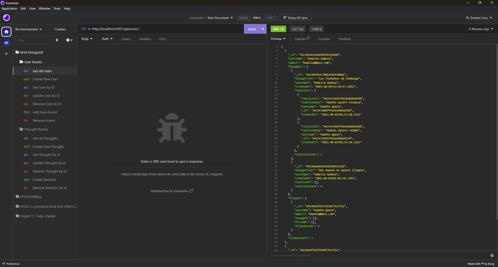

# M18_Social_Network_API-ECR
API for a social network web application where users can share their thoughts, react to friends’ thoughts, and create a friend list. Using Express.js for routing, a MongoDB database, and the Mongoose ODM. 

# M18C Social Network API - ECR

## Description

API for a social network web application where users can share their thoughts, react to friends’ thoughts, and create a friend list. Using Express.js for routing, a MongoDB database, and the Mongoose ODM.

## Table of Contents
- [ Walkthrough ](#walkthrough)
- [ Instalation ](#instalation)
- [ Usage ](#usage)
- [ License](#license)
- [ Contributing](#Contributing)
- [ Test ](#test)
- [ Questions ](#questions)

## Walkthrough

The following screenshot shows the functionality of the API routes using insomnia: 

You can see the [walkthrough video here.](https://drive.google.com/file/d/16qVTh4Tk5aPRwp-NqP9EwQE56satM2-Z/view)

## Instalation

To install necessary dependencies, run the following command:

> npm i

>npm start

## Usage

You can  clone the repository in your own computer, if so please follow the instalation process. 

  
## License
    
This project is licensed under the following license:

## Contributing

This repository is open source and contributions are welcome. If you have any ideas for improvements, please feel free to open an issue or submit a pull request.

## Questions

If you have any questions about the repo, open an issue or contact me directly at [cruz.rosales.ernesto@gmail.com](mailto:cruz.rosales.ernesto@gmail.com). You can find more of my work at [neto1895](https://github.com/neto1895)

